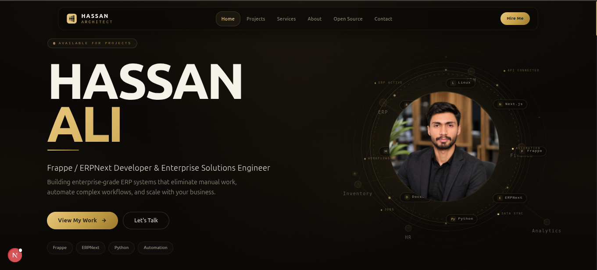
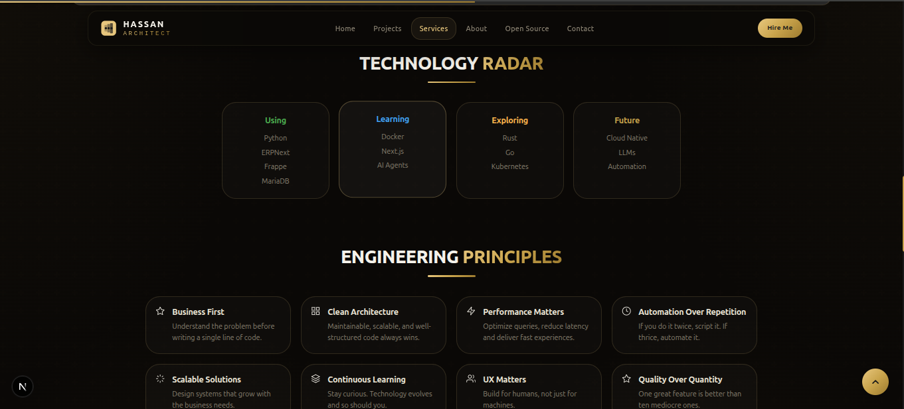
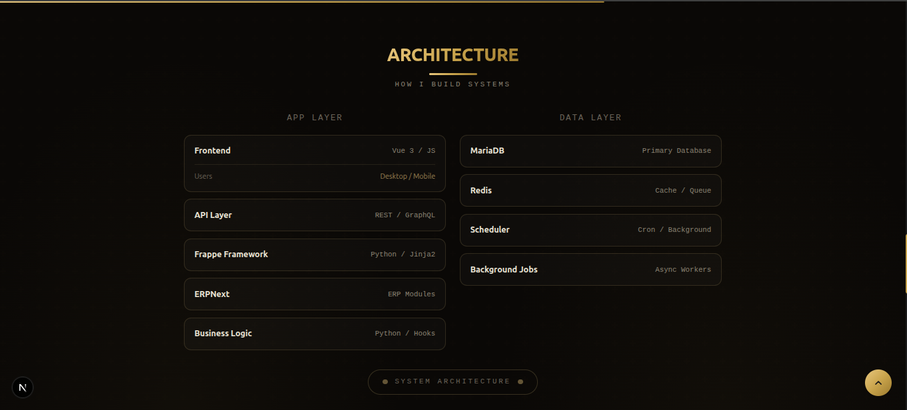
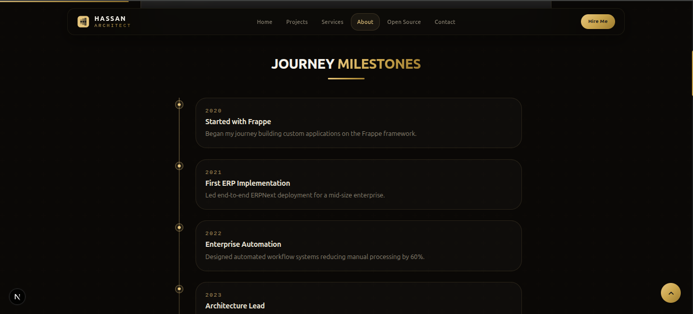
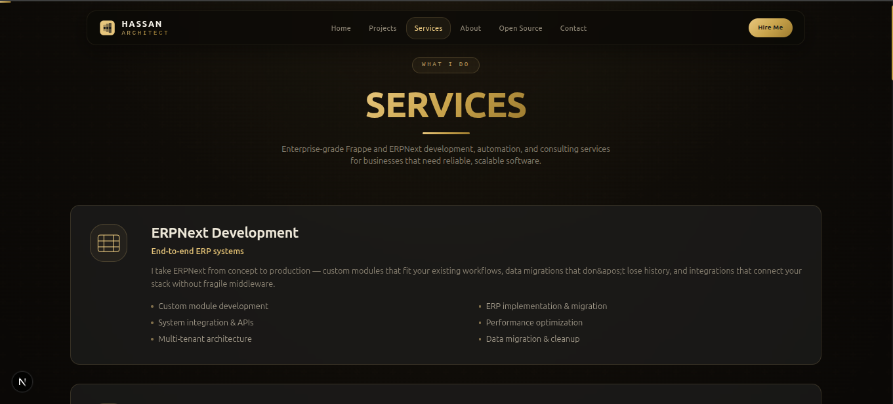
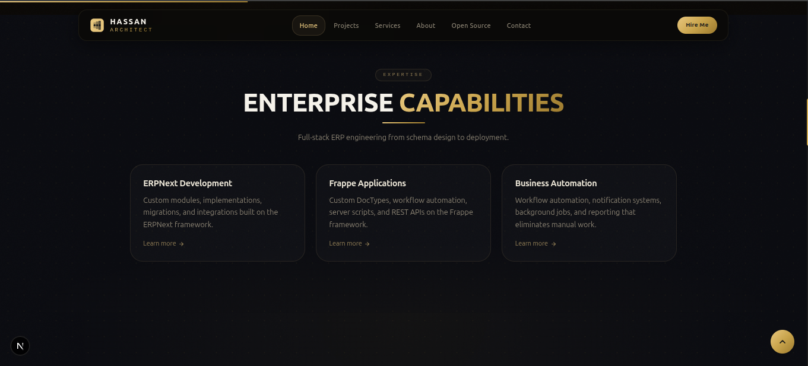
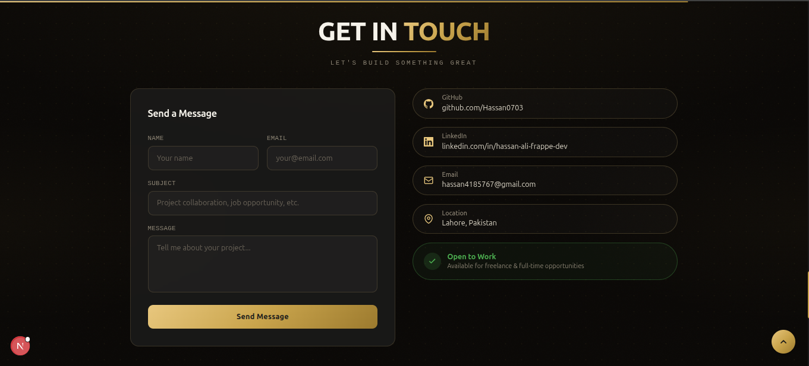
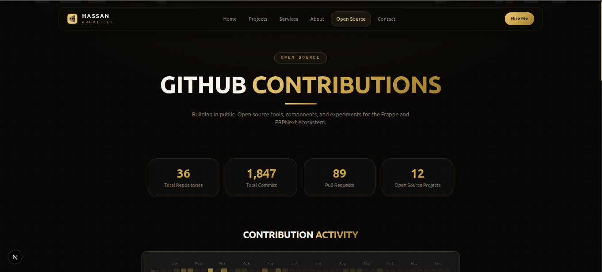

<div align="center">

# 🚀 Hassan Ali — Frappe/ERPNext Architect & Full-Stack Developer Portfolio

### A blazing-fast, fully responsive, SEO-optimized personal portfolio built with Next.js 15, React 19 & Tailwind CSS 4

[](https://nextjs.org/)
[](https://react.dev/)
[](https://www.typescriptlang.org/)
[](https://tailwindcss.com/)
[](https://www.framer.com/motion/)
[](./LICENSE)

[](https://github.com/Hassan0703/hassan-ali-nextjs-portfolio/stargazers)
[](https://github.com/Hassan0703/hassan-ali-nextjs-portfolio/network/members)
[](https://github.com/Hassan0703/hassan-ali-nextjs-portfolio/issues)

[**🌐 Live Site**](https://hassanali.dev) · [**🐛 Report Bug**](https://github.com/Hassan0703/hassan-ali-nextjs-portfolio/issues/new?labels=bug) · [**✨ Request Feature**](https://github.com/Hassan0703/hassan-ali-nextjs-portfolio/issues/new?labels=enhancement)

</div>

---

## 📸 Preview

<div align="center">
  
  <p><em>Hero Section — Desktop View</em></p>
</div>

<table>
  <tr>
    <td width="50%"><p align="center"><em>Technology Radar Section</em></p></td>
    <td width="50%"><p align="center"><em>Architecture Section</em></p></td>
  </tr>
  <tr>
    <td width="50%"><p align="center"><em>Journey Milestones</em></p></td>
    <td width="50%"><p align="center"><em>Services Section</em></p></td>
  </tr>
  <tr>
    <td width="50%"><p align="center"><em>Enterprise Capabilities</em></p></td>
    <td width="50%"><p align="center"><em>Get In Touch Section</em></p></td>
  </tr>
  <tr>
    <td width="50%"><p align="center"><em>GitHub Contributions</em></p></td>
  </tr>
</table>

---

## 📑 Table of Contents

- [About the Project](#-about-the-project)
- [Key Features](#-key-features)
- [Tech Stack](#-tech-stack)
- [Featured Projects Showcased](#-featured-projects-showcased)
- [Lighthouse & SEO Scores](#-lighthouse--seo-scores)
- [Getting Started](#-getting-started)
- [Project Structure](#-project-structure)
- [Available Scripts](#-available-scripts)
- [Deployment](#-deployment)
- [SEO Implementation](#-seo-implementation)
- [Roadmap](#-roadmap)
- [Contributing](#-contributing)
- [License](#-license)
- [Contact](#-contact)
- [Show Your Support](#-show-your-support)

---

## 📖 About the Project

This is the source code for my personal developer portfolio — a modern, minimal, and lightning-fast website built to showcase my projects, skills, and professional experience as a **Frappe/ERPNext Architect & Full-Stack Engineer** based in Lahore, Pakistan.

It's built with performance and discoverability as first-class citizens: a fully static Next.js App Router export, semantic HTML, a complete Metadata/Open Graph/Twitter Card setup, and a dynamic sitemap — with a 100/100 target Lighthouse score across Performance, Accessibility, Best Practices, and SEO.

**Why this repo exists:**
- 📌 A living showcase of my real-world projects and skills
- 📌 A reference implementation of a production-grade, SEO-optimized Next.js site
- 📌 Open-sourced so other developers can learn from or fork the structure

---

## ✨ Key Features

- ⚡ **Blazing Fast** — Next.js App Router, static export (`output: "export"`), fully pre-rendered
- 🎬 **Custom Loading Screen** — Animated intro sequence built with Framer Motion
- 🖱️ **Magnetic Buttons & Interactive SVG** — Micro-interactions that respond to cursor position
- 📊 **Scroll Progress Bar & Back-to-Top** — Polished scroll UX across every page
- 🧭 **Multi-Page Architecture** — Home, About, Projects, Services, Open Source, Contact, and dynamic `/project/[slug]` case-study pages
- 🌐 **Community Section** — GitHub contribution stats and open-source presence
- 📱 **Fully Responsive** — Custom hooks (`use-scrollspy`, `use-scroll-direction`, `use-mouse-position`) power adaptive, device-aware UI
- 🔍 **SEO Optimized** — Full `Metadata` API, Open Graph + Twitter Cards, dynamic `sitemap.ts` & `robots.ts`, JSON-friendly structured routes
- ♿ **Accessible** — Skip-to-content link, semantic HTML, keyboard-navigable
- 📬 **Working Contact Section** — Direct email + social integration
- 🧩 **Modular Components** — 16+ purpose-built components (hero, skills, experience, projects, contact, footer, navigation, etc.)

---

## 🛠 Tech Stack

| Category | Technology |
|---|---|
| **Framework** | [Next.js 15](https://nextjs.org/) (App Router, static export) |
| **UI Library** | [React 19](https://react.dev/) |
| **Language** | [TypeScript 5.7](https://www.typescriptlang.org/) |
| **Styling** | [Tailwind CSS 4](https://tailwindcss.com/) |
| **Animation** | [Framer Motion 12](https://www.framer.com/motion/) |
| **Fonts** | Inter, Plus Jakarta Sans, Bebas Neue, Sora (via `next/font/google`) |
| **Deployment** | Static export — deployable to Vercel, Netlify, or GitHub Pages |
| **Linting** | ESLint (Next.js config) |

---

## 💼 Featured Projects Showcased

The portfolio's Projects section highlights real, shipped work, including:

- **Gifoy Shop** — Ecommerce × Frappe integration
- **NxT Car Rental** — Car rental management software
- **Everest Invoicing** — SQLite × Flask × HTML/CSS desktop invoicing app
- **FrapXel** — Branded invoicing system with a complete site build
- **ERPNova UI** — Vue 3 component kit for ERPNext
- **Nexilo Loan App** — ERPNext × Frappe loan management integration

Full case studies live at `/project/[slug]` for each entry.

---

## 🚦 Lighthouse & SEO Scores

<div align="center">

| Performance | Accessibility | Best Practices | SEO |
|:---:|:---:|:---:|:---:|
|  |  |  |  |

</div>

> Run `npx unlighthouse --site your-live-url.vercel.app` or check via Chrome DevTools → Lighthouse, then update these badges with your real scores.

---

## 🏁 Getting Started

### Prerequisites

- [Node.js](https://nodejs.org/) `v18.17` or later
- npm / yarn / pnpm

### Installation

```bash
# 1. Clone the repository
git clone https://github.com/Hassan0703/hassan-ali-nextjs-portfolio.git

# 2. Navigate into the project directory
cd hassan-ali-nextjs-portfolio

# 3. Install dependencies
npm install

# 4. Run the development server
npm run dev
```

Open [http://localhost:3000](http://localhost:3000) in your browser to view it.

---

## 📁 Project Structure

```
hassan-ali-nextjs-portfolio/
├── src/
│   ├── app/
│   │   ├── layout.tsx              # Root layout + global SEO metadata
│   │   ├── page.tsx                # Home page
│   │   ├── about/page.tsx
│   │   ├── projects/page.tsx
│   │   ├── project/[slug]/         # Dynamic project case-study pages
│   │   ├── services/page.tsx
│   │   ├── open-source/page.tsx
│   │   ├── contact/page.tsx
│   │   ├── not-found.tsx
│   │   ├── template.tsx
│   │   ├── sitemap.ts               # Auto-generated sitemap.xml
│   │   ├── robots.ts                # Auto-generated robots.txt
│   │   └── globals.css
│   ├── components/                  # hero, skills, experience, projects,
│   │                                 # community, contact, footer, navigation,
│   │                                 # loading-screen, magnetic-button, etc.
│   ├── hooks/                       # use-scrollspy, use-mouse-position,
│   │                                 # use-scroll-direction, use-hydrated
│   └── lib/
│       └── utils.ts
├── public/
│   ├── Profile-pic.png
│   ├── favicon.svg
│   └── site.webmanifest
├── next.config.ts                   # output: "export"
├── tailwind.config.ts
├── tsconfig.json
├── .gitignore
└── README.md
```

---

## 📜 Available Scripts

| Command | Description |
|---|---|
| `npm run dev` | Runs the app in development mode |
| `npm run build` | Builds the app for production |
| `npm run start` | Runs the built app in production mode |
| `npm run lint` | Runs ESLint |

---

## ☁️ Deployment

This project builds as a fully **static export** (`output: "export"` in `next.config.ts`), so it can be deployed anywhere that serves static files:

**Vercel (recommended):**
[](https://vercel.com/new/clone?repository-url=https://github.com/Hassan0703/hassan-ali-nextjs-portfolio)

**GitHub Pages / Netlify / any static host:**
```bash
npm run build
# Static site is generated in the /out directory — deploy that folder
```

Currently live at **[hassanali.dev](https://hassanali.dev)**.

---

## 🔍 SEO Implementation

This project takes SEO seriously. Currently implemented:

- ✅ Dynamic `metadata` API (title template, description, keyword array, author)
- ✅ Open Graph & Twitter Card tags for rich social previews
- ✅ Full `robots` directives (`max-image-preview`, `max-snippet`, etc.)
- ✅ Auto-generated `sitemap.xml` (`sitemap.ts`) and `robots.txt` (`robots.ts`)
- ✅ Semantic HTML with a skip-to-content link for accessibility & crawlability
- ✅ `next/font` with `display: swap` for zero font-related layout shift

**Planned / in progress** — see [`SEO-GUIDE.md`](./SEO-GUIDE.md) for the full audit and exact fixes:
- ⬜ JSON-LD structured data (`Person` schema)
- ⬜ `og-image.png` (currently referenced in metadata but missing from `/public`)
- ⬜ Per-route metadata verification across all pages

---

## 🗺 Roadmap

- [ ] Add blog section with MDX support
- [ ] Add multi-language support (i18n)
- [ ] Add CMS integration (Sanity/Contentful) for project data
- [ ] Add unit + E2E tests (Jest + Playwright)

See [open issues](https://github.com/Hassan0703/hassan-ali-nextjs-portfolio/issues) for a full list of proposed features.

---

## 🤝 Contributing

Contributions, issues, and feature requests are welcome! See [CONTRIBUTING.md](./CONTRIBUTING.md) for guidelines.

1. Fork the project
2. Create your feature branch (`git checkout -b feature/amazing-feature`)
3. Commit your changes (`git commit -m 'Add some amazing feature'`)
4. Push to the branch (`git push origin feature/amazing-feature`)
5. Open a Pull Request

---

## 📄 License

Distributed under the MIT License. See [`LICENSE`](./LICENSE) for more information.

---

## 📬 Contact

**Hassan Ali** — Frappe/ERPNext Developer @ NexTash Software House

[](https://github.com/Hassan0703)
[](https://linkedin.com/in/hassan-ali-frappe-dev)

Project Link: [https://github.com/Hassan0703/hassan-ali-nextjs-portfolio](https://github.com/Hassan0703/hassan-ali-nextjs-portfolio)

---

## ⭐ Show Your Support

If this project helped you or you found it interesting, please consider giving it a **⭐ star** — it helps the repo rank higher in GitHub search and reach more developers!

<div align="center">

**[⬆ back to top](#-hassan-ali--frappeerpnext-architect--full-stack-developer-portfolio)**

</div>
